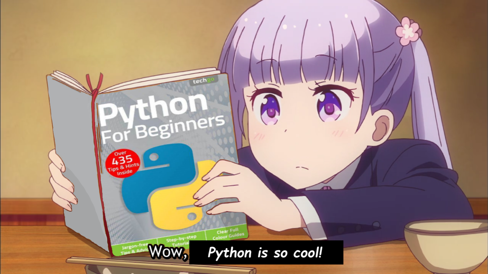

<p align="center">
<!-- Better late than never. -->
<br>
<!-- <i>Change is scary... but so is staying the same. 🌸</i> -->
<p align="center">

</p>
  
</p>

<p align="center">
<i>Crafting beautiful, "useful" stuff 🍓</i>
</p>

<p align="center">
  <b>Frontend:</b>
  <br>
  <a href="https://skillicons.dev">
    
  </a>
</p>

<p align="center">
  <b>Backend & scripting:</b>
  <br>
  <a href="https://skillicons.dev">
    
  </a>
</p>

<p align="center">
  <b>Infra:</b>
  <br>
  
  <a href="https://skillicons.dev">
    
  </a>
</p>

---
 
```
20s · self-taught · 🇨🇴
InfoSec · offensive sec · systems · full-stack
```
 
---

<p align="center">
powered by ☕️
</p>
<p align="center">
  
</p>
